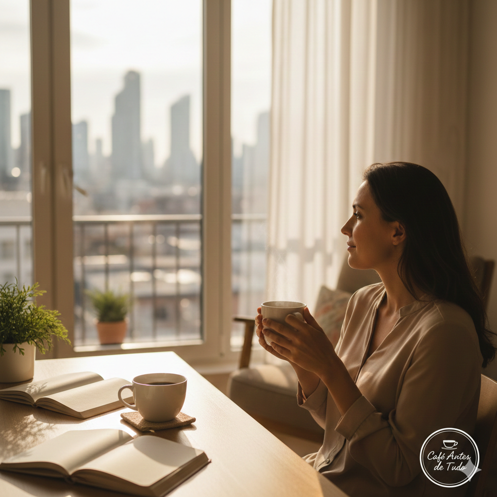
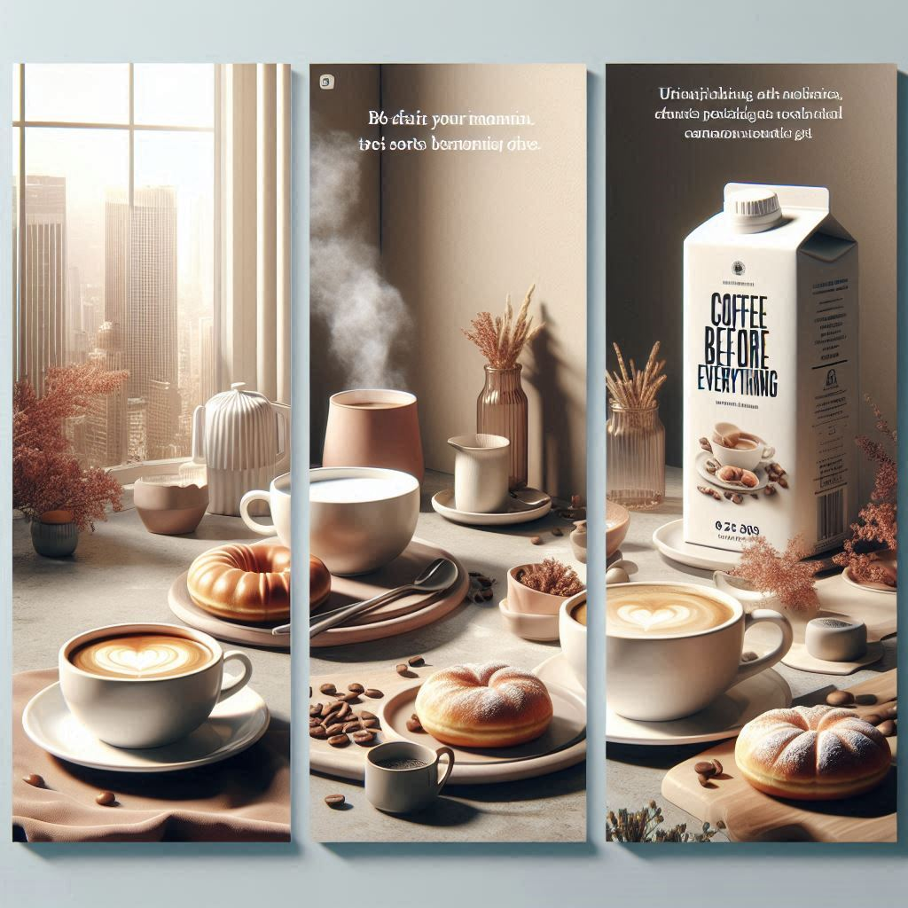
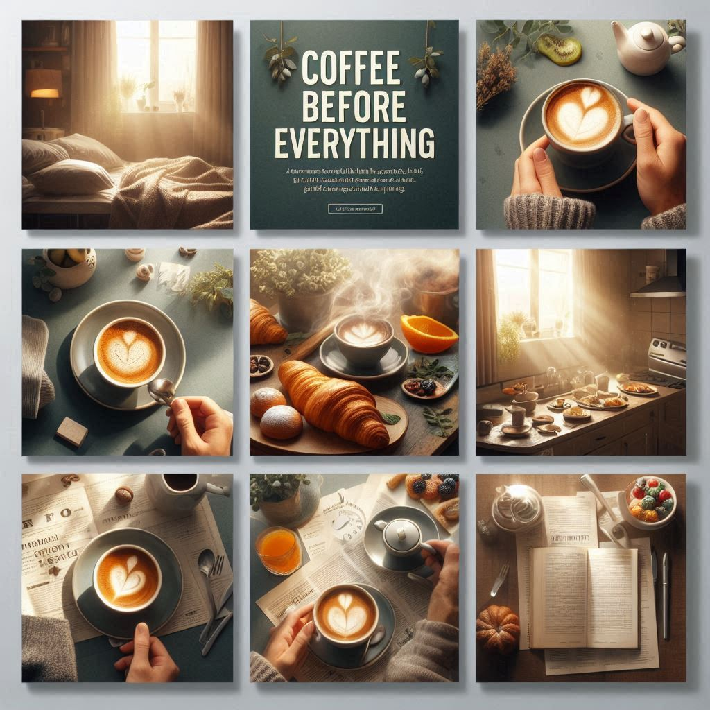
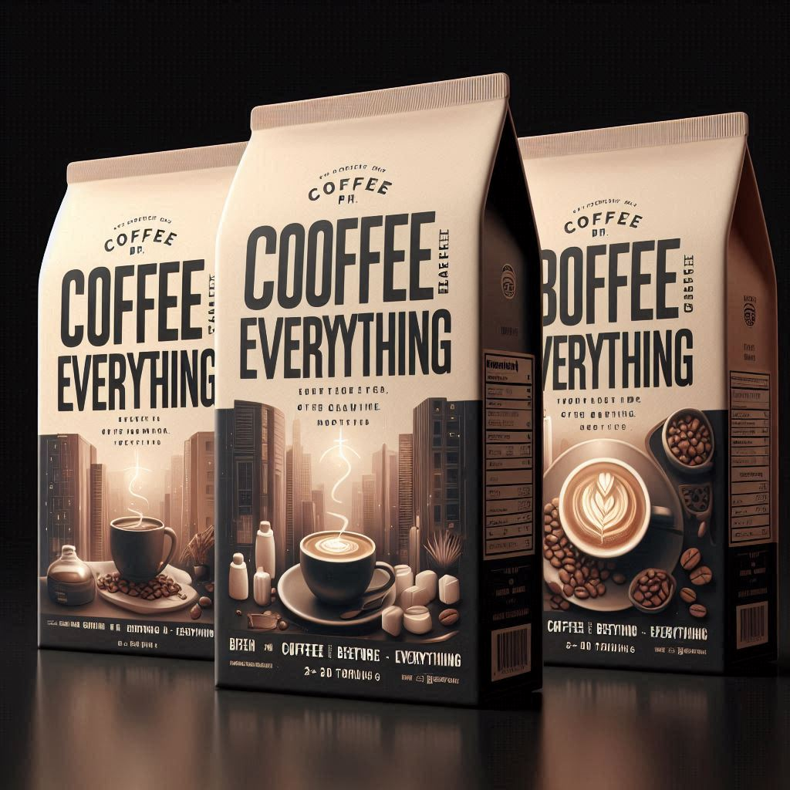
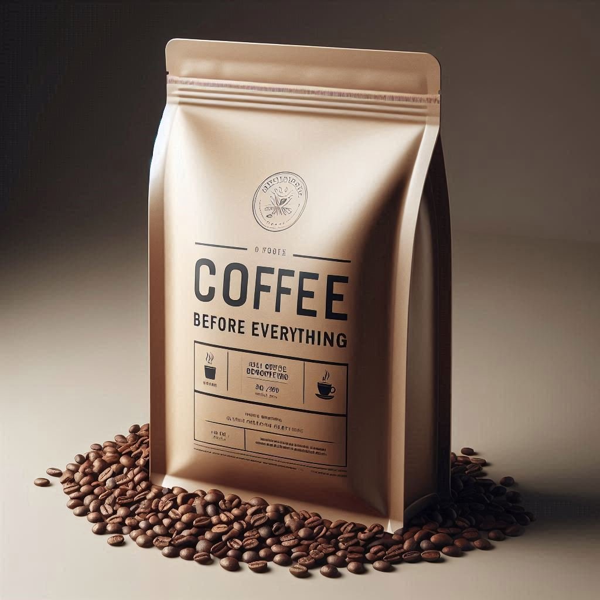
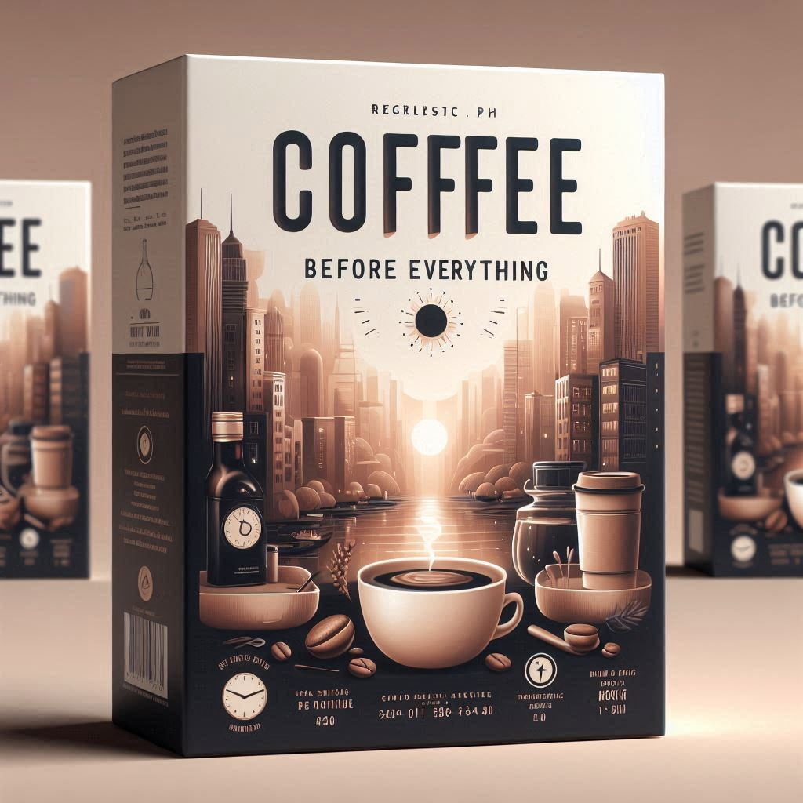
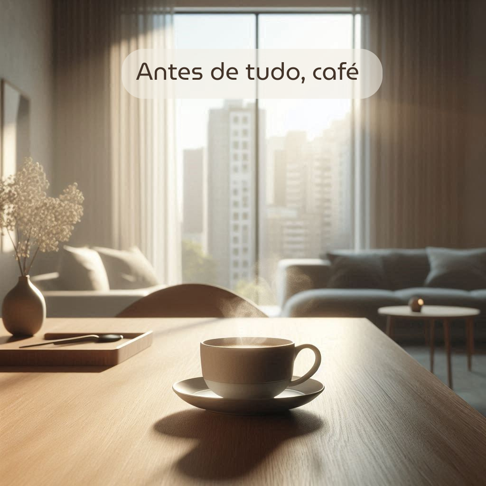
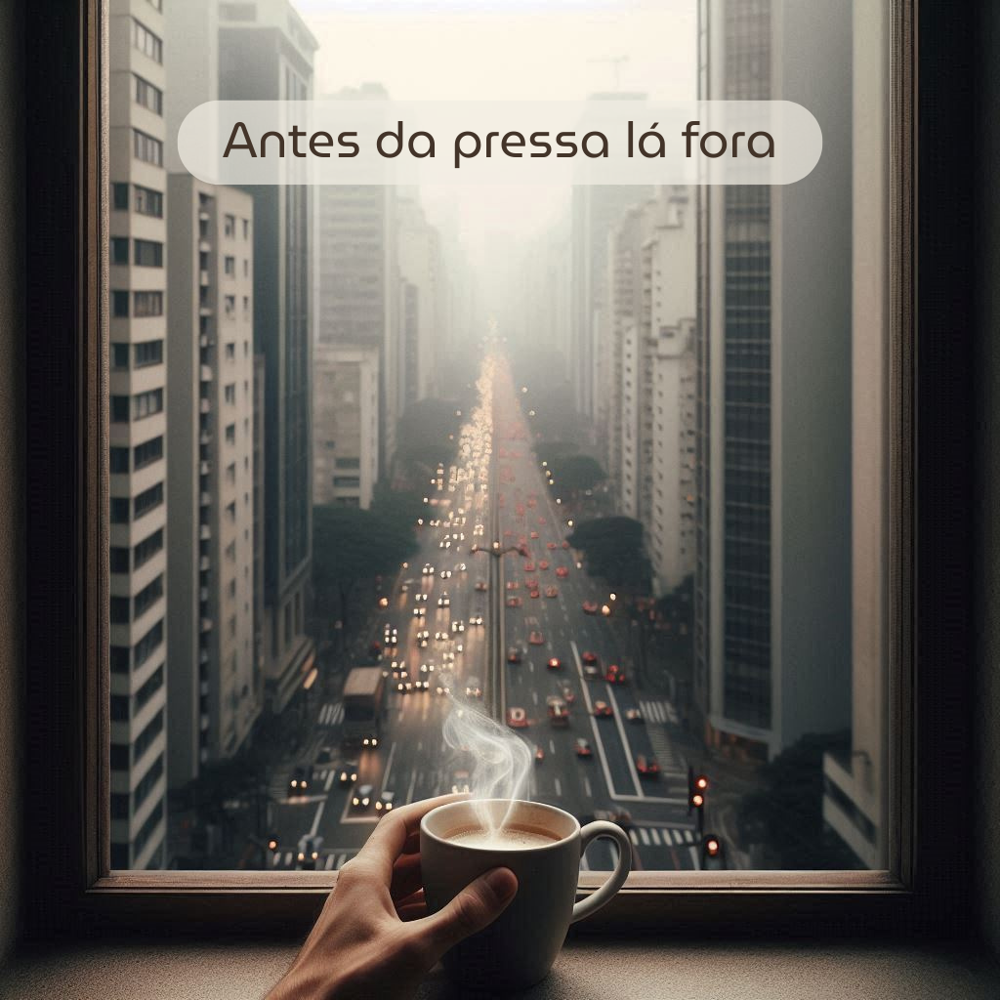

# Criação de Carrossel para Instagram de Marca Fictícia de Café ☕✨

## 📒 Descrição
A ideia deste projeto foi criar uma **marca fictícia de café**, definindo seu público-alvo e posicionamento, e a partir disso desenvolver um **post para redes sociais**.

O formato escolhido foi o **carrossel do Instagram**, por permitir trabalhar múltiplas imagens dentro de um mesmo conceito. Isso possibilitou observar como as IAs generativas lidam com **continuidade visual, narrativa e coerência estética** ao longo de mais de uma imagem, além de comparar os resultados entre diferentes ferramentas.

A marca criada para este exercício se chama **Coffee Before Everything**, uma marca urbana, jovem e contemporânea, voltada para pessoas entre 30 e 40 anos que vivem em apartamentos em grandes cidades, como São Paulo, e valorizam o ritual do café como parte essencial do dia a dia.

---

## 🤖 Tecnologias Utilizadas
- **ChatGPT** – criação do conceito da marca, posicionamento e prompts
- **Gemini** – geração inicial de imagens a partir de texto descritivo
- **Bing AI (Image Creator)** – geração de imagens e packshot do produto
- **Canva AI** – ajustes visuais, composição do carrossel e aplicação de textos

---

## 🧐 Processo de Criação
O processo começou com o **ChatGPT**, utilizado para estruturar o conceito da marca, seu tom de voz e identidade geral. A proposta era criar algo **jovem, moderno, urbano e realista**, alinhado a um público adulto e consumidor de cafés premium.  
Nesse momento, também solicitei sugestões de nome e prompts para a criação das imagens em outras IAs.

Com o conceito definido, iniciei os testes de geração de imagem:

- **ChatGPT (imagens)**: gerou um carrossel visualmente interessante, porém com imagens muito genéricas e pouco alinhadas a uma identidade de marca clara.

- **Gemini**: a partir de um texto explicativo escrito por mim, solicitei a criação de um carrossel. A ferramenta gerou apenas uma imagem e apresentou inconsistências visuais, como uma pessoa segurando duas xícaras de café ao mesmo tempo.

- **Bing AI**: foi a ferramenta que apresentou os melhores resultados. Quando solicitada a criação de várias imagens, conseguiu gerar uma narrativa visual, porém com repetição de imagens, falta de realismo em alguns detalhes e erros frequentes de digitação nos textos.

Em um segundo momento, pedi ao Bing AI apenas a criação de um **packshot** do produto. Esse foi o resultado mais próximo do esperado em termos visuais, mas ainda apresentou erros tipográficos que não puderam ser corrigidos, mesmo após diversas variações de prompt.

Tentei então utilizar a **IA do Canva** para corrigir apenas os textos das imagens. No entanto, os resultados foram inconsistentes: em alguns casos a ferramenta não entendeu o pedido e, em outros, alterou elementos visuais que não deveriam ser modificados.

Como solução final, optei por gerar **imagem por imagem** utilizando prompts mais específicos criados no ChatGPT e aplicados no Bing AI. Em seguida, montei manualmente o carrossel no Canva, inserindo os textos individualmente para garantir maior controle estético e coerência visual.

---

## 🚀 Resultados
O resultado final é um **carrossel de Instagram** com uma narrativa visual mais consistente, estética urbana e alinhada ao posicionamento da marca **Coffee Before Everything**.

O processo demonstrou como as IAs generativas podem acelerar a criação de conceitos e imagens, mas ainda exigem **curadoria humana**, ajustes manuais e refinamento visual para alcançar um resultado mais realista e próximo do desejado.

---

## 💭 Reflexão
Durante o desenvolvimento do projeto, ficou claro que as IAs ainda apresentam limitações na criação de imagens totalmente realistas, especialmente quando envolvem texto, continuidade visual e pequenos detalhes.

Foi necessário reescrever prompts diversas vezes e intervir manualmente em algumas etapas para alcançar um resultado satisfatório.  
Apesar disso, o uso das IAs foi extremamente positivo como ferramenta de apoio criativo, explorando possibilidades rápidas e ajudando a estruturar ideias de forma mais ágil.

O resultado final é bom, embora ainda não ideal, reforçando a importância do olhar humano no processo criativo.
